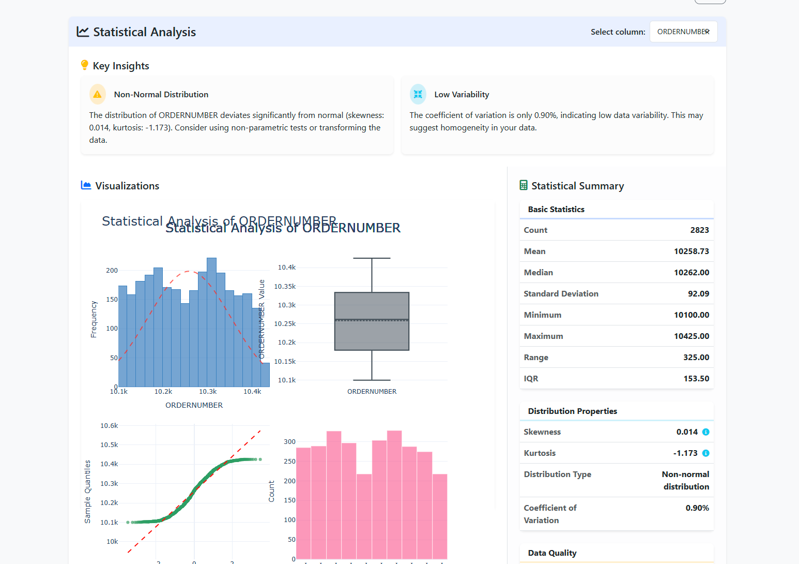

N# AI Analyst

A Django-based AI data analysis platform with dashboard visualization, designed to analyze data, generate insights, and visualize results in customizable dashboards.



## Features

- **Data Source Management**: Upload CSV, Excel, JSON files or connect to databases (MySQL, PostgreSQL, Supabase)
- **AI-Powered Analysis**: Run various analyses including clustering, classification, regression, time series, and statistical analysis
- **Natural Language Interface**: Ask questions about your data in plain English
- **Interactive Dashboards**: Create customizable dashboards with drag-and-drop widgets
- **Dynamic Visualizations**: Automatically generate appropriate visualizations based on data analysis
- **Dashboard Widgets**: Add analysis results as widgets to dashboards with various chart types (bar, line, pie)

## Installation

### Prerequisites

- Python 3.8+
- Django 4.2.10
- Node.js (for some frontend dependencies)

### Setup

1. Clone the repository:
   ```bash
   git clone https://github.com/your-username/ai-analyst.git
   cd ai-analyst
   ```

2. Create and activate a virtual environment:
   ```bash
   python -m venv venv
   
   # On Windows
   venv\Scripts\activate
   
   # On macOS/Linux
   source venv/bin/activate
   ```

3. Install dependencies:
   ```bash
   pip install -r requirements.txt
   ```

4. Set up environment variables in a `.env` file:
   ```
   DEBUG=True
   SECRET_KEY=your-secret-key
   DATABASE_URL=your-database-url
   OPENAI_API_KEY=your-openai-api-key
   ```

5. Run migrations:
   ```bash
   python manage.py migrate
   ```

6. Create a superuser (admin):
   ```bash
   python manage.py createsuperuser
   ```

7. Start the development server:
   ```bash
   python manage.py runserver
   ```

8. Visit `http://127.0.0.1:8000/` in your browser

## Usage

### Uploading Data

1. Navigate to the Data Sources section
2. Click "Add Data Source"
3. Upload your CSV, Excel, or JSON file, or connect to a database
4. Your data will be processed and made available for analysis

### Running Analysis

1. Select a data source
2. Choose an analysis type (clustering, classification, etc.)
3. Configure analysis parameters
4. Run the analysis
5. View the results, including AI-generated insights and visualizations

### Creating Dashboards

1. Navigate to the Dashboards section
2. Click "Create Dashboard"
3. Give your dashboard a name and description
4. Add widgets from your analyses
5. Customize widget size, position, and appearance
6. Save your dashboard

## Technologies Used

- **Backend**: Django, Python, pandas, numpy, scikit-learn
- **Frontend**: HTML, CSS, JavaScript, Bootstrap
- **Visualization**: Chart.js
- **AI/ML**: OpenAI API, scikit-learn, TensorFlow
- **Database**: SQLite (development), PostgreSQL (production)

## Contributing

Contributions are welcome! Please feel free to submit a Pull Request.

## License

This project is licensed under the MIT License - see the LICENSE file for details.

## Acknowledgements

- [Django](https://www.djangoproject.com/)
- [Chart.js](https://www.chartjs.org/)
- [OpenAI](https://openai.com/)
- [Bootstrap](https://getbootstrap.com/)
